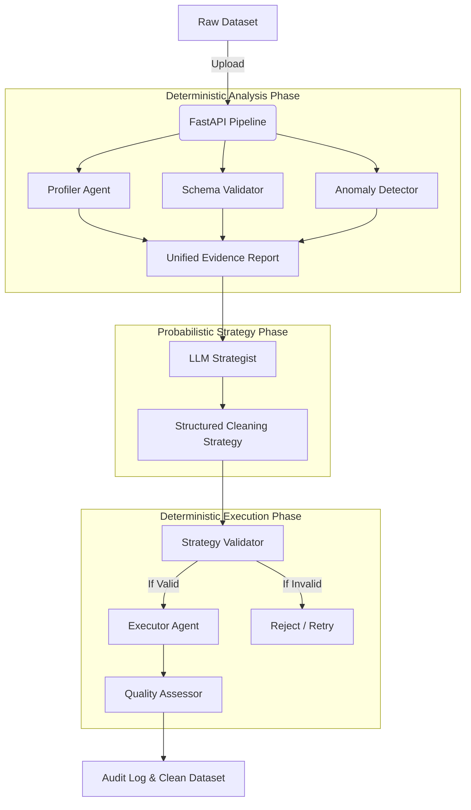

# AI Data Cleaning Agent Team
> Deterministic Data Quality + LLM-Based Cleaning Strategy


An AI-assisted, multi-agent data quality and cleaning platform that combines deterministic data engineering with LLM-based reasoning. 

Data cleaning is often a tedious, repetitive task for data engineers. However, blindly giving raw datasets to Large Language Models (LLMs) is fundamentally unsafe it risks hallucinated data, schema corruption, unpredictable transformations, and catastrophic data loss. 

This project solves this by enforcing a strict engineering principle: **"LLMs recommend; deterministic systems execute."** Raw datasets are never modified by or even sent to the LLM. Instead, a suite of deterministic agents profiles the data, extracts evidence, and passes statistical metadata to an LLM Strategist. The LLM acts purely as a reasoning engine to formulate a structured cleaning plan. That plan is then rigorously validated against safety thresholds before a deterministic Python executor performs the actual Pandas transformations.

---

## 🏗️ System Architecture

Traditional Naive LLM approach:
`Raw Dataset` ➔ `LLM` ➔ `Direct Modification (Unsafe)`

**This project's approach:**



## ✨ Key Features

- **Automated Dataset Profiling:** Deterministic statistical extraction (missingness, distribution, inferred types).
- **Schema & Anomaly Detection:** IQR/Z-score outlier detection and strict type boundary checks.
- **LLM-Based Strategy Generation:** Utilizes local LLMs (via Ollama) to reason over data issues.
- **Structured LLM Outputs:** Enforces strict Pydantic schema generation.
- **Strategy Validation:** Hard-coded safety limits (e.g., max row drops, duplicate actions) that reject unsafe LLM plans.
- **Deterministic Execution:** Uses pure Pandas operations (no `eval()` or LLM-generated code execution).
- **Before/After Quality Validation:** Automatically scores dataset improvement and fails the pipeline if quality degrades.
- **REST API:** Fully modular pipeline via FastAPI endpoints.
- **Web Dashboard:** Interactive Next.js + Tailwind glassmorphism dashboard to visualize recommendations and approve strategies.
- **Test Suite:** Extensive E2E pipeline tests including adversarial LLM failure simulations.

## 🛡️ Why This Architecture?

**Why not let the LLM clean the dataset?**
Giving an LLM direct access to modify data or write executable Python introduces massive security vulnerabilities (arbitrary code execution), reproducibility issues, and silent data corruption (hallucinated values). 

**Why combine both?**
We need the semantic reasoning capabilities of an LLM to decide *how* to handle a missing value (e.g., median vs. mode imputation based on domain context), but we need the reliability of a deterministic system to actually *apply* the mathematical transformation. 

| Responsibility | Deterministic System | LLM |
| :--- | :---: | :---: |
| Statistical profiling | ✅ | ❌ |
| Schema validation | ✅ | ❌ |
| Outlier calculation | ✅ | ❌ |
| Strategy reasoning | ❌ | ✅ |
| Data modification | ✅ | ❌ |
| Human-readable explanation | ❌ | ✅ |

## 🤖 Agent Responsibility Matrix

| Agent | Type | Responsibility | Input | Output |
| :--- | :--- | :--- | :--- | :--- |
| **Profiler Agent** | Deterministic | Extracts column types, null counts, min/max/mean metrics. | Raw Dataset (`pd.DataFrame`) | `ProfilerReport` |
| **Schema Validator** | Deterministic | Infers permissive schema & detects structural violations. | Dataset, Base Schema | `SchemaReport` |
| **Anomaly Detector** | Deterministic | Flags statistical outliers (IQR bounds). | Dataset | `AnomalyReport` |
| **LLM Strategist** | Probabilistic | Formulates a structured response plan to address issues. | Unified Evidence Reports | `CleaningStrategy` |
| **Strategy Validator** | Deterministic | Enforces safety thresholds (max drops, type checks). | `CleaningStrategy` | `ValidatedCleaningStrategy` |
| **Executor Agent** | Deterministic | Applies deterministic Pandas transformations. | Dataset, Validated Strategy | Clean Dataset, `ExecutionResult` |
| **Quality Assessor**| Deterministic | Compares before/after metrics to ensure improvement. | Original & Clean Datasets| `QualityReport` |

## ⚙️ Deterministic Execution

The `ExecutorAgent` only performs pre-programmed, parameterized operations. Currently implemented actions:
* `median_imputation`: Fills numeric nulls using the median.
* `mean_imputation`: Fills numeric nulls using the mean.
* `mode_imputation`: Fills categorical nulls using the mode.
* `constant_imputation`: Fills nulls with a parameterized value.
* `drop_rows`: Drops rows with nulls in the target column.
* `drop_column`: Removes the target column entirely.
* `cap_outliers`: Clamps extreme numeric values to bounds.
* `drop_outliers`: Removes rows containing outliers.
* `remove_duplicates`: Deduplicates exact row matches.
* `convert_datatype`: Safely casts column dtypes.

## 🔒 Safety and Security
- **Zero Code Execution:** The LLM does not generate executable Python or SQL. No `eval()` is used.
- **Strategy Allowlist:** The LLM can only select actions strictly defined in the `ActionRegistry`.
- **Original Dataset Preservation:** All cleaning happens on a working copy; the original file is preserved in local session state.
- **Bounded Operations:** The `StrategyValidator` enforces configurable hard limits (e.g., `MAX_ROW_DROP_PERCENTAGE`).

## 📁 Project Structure

```text
ai-research-agent/
├── agent/                 
│   ├── anomaly/
│   ├── executor/
│   ├── profiler/
│   ├── quality/
│   ├── strategist/
│   ├── strategy_validator/
│   └── validator/
├── backend/               
│   ├── main.py
│   └── routes/
│       └── pipeline.py     
├── data/                  
├── frontend/              
│   ├── app/
│   │   ├── pipeline/       
│   │   └── page.tsx        
│   └── components/
├── tests/                  
├── requirements.txt        
└── config.py               
```

## 🛠️ Tech Stack

| Layer | Technology | Purpose |
| :--- | :--- | :--- |
| **Backend** | FastAPI, Uvicorn | High-performance async REST API |
| **Data Processing** | Pandas, NumPy | Fast, deterministic data transformations |
| **LLM Provider** | Ollama | Local privacy-preserving LLM execution |
| **Validation** | Pydantic | Strict structured output and IO validation |
| **Frontend** | Next.js, React, TailwindCSS, Framer Motion | Dynamic, animated data pipeline dashboard |
| **Testing** | Pytest, HTTPX | End-to-end integration and adversarial testing |

## 🚀 Installation & Running Locally

### Prerequisites
- Python 3.10+
- Node.js 18+
- [Ollama](https://ollama.com/) (running locally with the `llama3` model pulled)

### 1. LLM Setup
Ensure Ollama is running, then pull the required model:
```bash
ollama pull llama3
```

### 2. Backend Setup
```bash
# Clone the repository
git clone https://github.com/samdwivedi/Agentic-DataCleaner-LLM-Guided-Multi-Agent-Data-Pipeline.git
cd Agentic-DataCleaner-LLM-Guided-Multi-Agent-Data-Pipeline

# Install Python dependencies
pip install -r requirements.txt

# Run the FastAPI server
cd backend
uvicorn main:app --reload --port 8000
```


### 3. Frontend Setup
In a new terminal instance:
```bash
cd frontend
npm install
npm run dev
```


## 🔌 API Documentation (Pipeline Routes)

The backend exposes a stateful session-based architecture under `/pipeline`:
- `POST /pipeline/upload` — Uploads CSV & initiates a UUID session.
- `POST /pipeline/{session_id}/analyze` — Runs Profiler, Schema, and Anomaly agents.
- `POST /pipeline/{session_id}/strategy` — Prompts LLM for a structured cleaning plan.
- `POST /pipeline/{session_id}/validate-strategy` — Validates proposed actions against thresholds.
- `POST /pipeline/{session_id}/execute` — Runs the deterministic Pandas executor.
- `POST /pipeline/{session_id}/validate-quality` — Scores before/after dataset metrics.
- `GET /pipeline/{session_id}/download` — Retrieves the cleaned CSV.

## ⚠️ Failure Modes & Resiliency

| Failure Scenario | System Behavior |
| :--- | :--- |
| **Invalid CSV Upload** | Upload is rejected immediately (400 Bad Request) and session is destroyed. |
| **LLM Unavailability** | Strategist catches `httpx.TimeoutException` or `RequestError` and gracefully fails (502 Bad Gateway), preserving session state for later retries. |
| **LLM Output Malformed** | Pydantic strictly rejects unparseable JSON or missing fields. |
| **Dangerous Strategy Proposed** | `StrategyValidator` flags limits (e.g. dropping too many rows) and rejects the strategy execution. |
| **Executor Operation Fails** | Executor traps Pandas errors, skips the failed step (maintaining original dataset), logs the error, and proceeds to the next valid action. |
| **Quality Degradation** | `QualityAssessor` flags a negative delta; dashboard notifies the user that the strategy was ineffective. |

